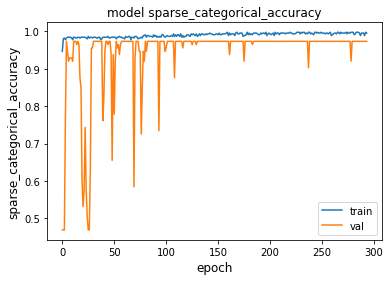
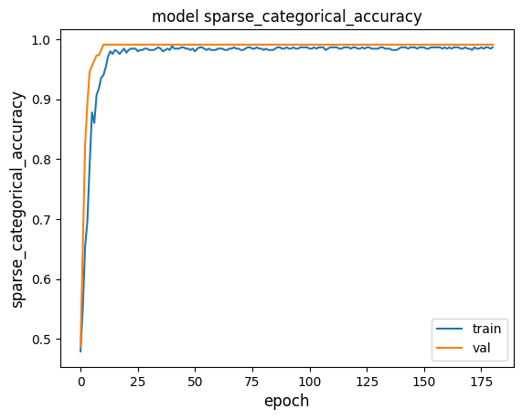

# Radiation dosimeter noise time series binary classificator using CNNs and transformers

## About the project
Radiation dosimetry is an essential field within radiation protection in order to measure the dose of ionizing radiation received by humans. Radiation emitted by external elements is measured by dosimeters and these must be used as part of the radiation protection equipment for all workers who may come into contact with radiation. There are different dosimeter technologies to measure the physical phenomenon of radiation and the one used in this project is based on PIN diodes.

These types of dosimeters are still in the research phase and have the great advantage of being very cheap to manufacture. However, one of the problems they have is that they can give false positives due to events such as shocks, heat sources or electromagnetic noise. In order to avoid these false positives, a supervised artificial intelligence algorithm has been trained to distinguish between the signals coming from real radiation sources and noise.

To obtain the training data, the time series signals generated by the dosimeter diode were recorded using an oscilloscope in a laboratory. A cesium-137 radiation source was used to generate the radiation time series data and in order to record false positives, the electrical noise produced by the diode’s buzzer alerting for high radiation was used. This dataset has been used to train two binary classifier models, one based on convolutional neural networks and another one based on transformers. Finally, the results of both algorithms have been evaluated using performance metrics and the champion model was chosen.

## Goals
- To discriminate noise and radiation signals measured with a PIN diode dosimeter using a binary classifier based on an artificial intelligence algorithm.
- To record the time series data of noise and radiation in a laboratory setup.
- To analyze the time series data to check for patterns and differences between the radiation and noise time series recordings. 
- To clean and process the measurement data. 
- To train an architecture based on convolutional neural networks (CNN) for the binary classification of the time series data.
- To train an architecture based on transformers for the binary classification of the time series data.
- To analyze the computational cost of both models, measuring the inference time for the test data using the CPU and GPU.
- To analyze the performance metrics of the models and to choose the champion model.
## Results
### CNN

The best accuracy during training for the test data is 99.30 %.

### Transformers

The best accuracy during training for the test data is 98.67 %.

### Computational cost
Average time used for an inference between models and hardware:

### Champion model
The transformer model has been chosen as the champion model due to its stability during training through all the epochs.
